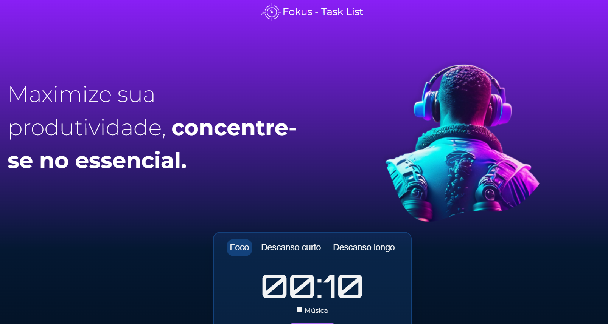
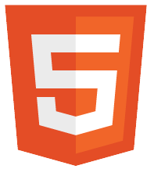

# Fokus - Task List

## 📖 Descrição

Fokus - Task List é uma aplicação web desenvolvida para ajudar você a gerenciar suas tarefas e melhorar sua produtividade. O projeto possui um cronômetro integrado que ajuda a marcar o tempo de atividade e descanso, seguindo a técnica Pomodoro, com períodos de foco, descanso curto e descanso longo. Este projeto foi desenvolvido com base no curso oferecido pela Alura.

## 🎯 Objetivo

° Adicionar, editar e remover tarefas conforme sua necessidade.
° Temporizador para períodos de foco, descanso curto e descanso longo.

## 🛠️ Tecnologias Utilizadas

 Estruturação do conteúdo.

 Estilização e layout.

 Funcionalidade e lógica do cronômetro e lista de tarefas.

## ⌛ Status do Projeto

Concluído
